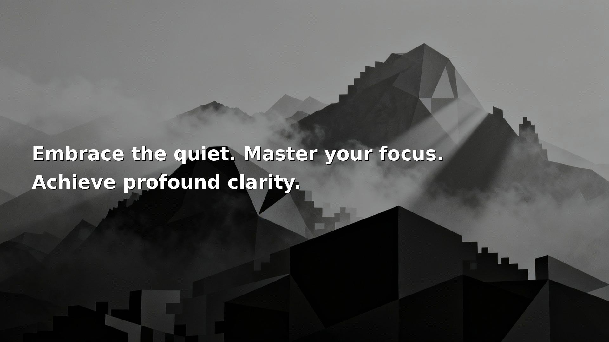

# Gen-Wal 🧠

**Your desktop becomes your quiet daily coach.**


> A personal-first AI daemon that generates a personalized motivational
> wallpaper on your desktop every morning.\
> Private. Beautiful. Automatic.

------------------------------------------------------------------------

## Why?

I built this as a small tool for myself. I realized that keeping my goals in my head wasn't enough—I needed a constant reminder that **actions take a person further**. 

Instead of another app I have to open, Gen-Wal just exists. It runs quietly, ensuring that the first thing I see every morning is a nudge to do the work.

------------------------------------------------------------------------

## What It Does

• Generates a new wallpaper every morning\
• Uses your personal profile (goals, habits, mindset)\
• Runs with a local AI brain (llama.cpp / Ollama) or Cloud (Pollinations / Hugging Face)\
• Auto-contrast typography for perfect readability\
• systemd-powered scheduling\
• Modular architecture for quotes, images, and prompts

------------------------------------------------------------------------

## Example Wallpapers


| **Founder Profile** | **Monk Profile** |
| :---: | :---: |
|  |  |

| **Gym Profile** | **Founder Profile (Variant)** |
| :---: | :---: |
|  |  |


------------------------------------------------------------------------

60-Second Install
``` bash
curl -fsSL https://laptopserver.dev/genwal | bash
```

Installs:
• **Gen-Wal** (Python-based AI daemon)
• **Systemd** daily service
• **Zero-Config** default (uses Pollinations.ai)
• **Interactive** Setup Wizard (Profile & Vibe)

You'll get your first personalized wallpaper in under 2 minutes. No heavy downloads required.

> **Power User?** You can still switch to local LLMs (Ollama/Llama.cpp) in `config.yaml` after install.

------------------------------------------------------------------------

## Customize Your Mindset

``` yaml
profile_path: "profiles/my_profile.md"

quote_provider: "llm:ollama"
image_provider: "pollinations:image"
image_prompt_provider: "pollinations:text"

llm:
  ollama:
    base_url: "http://localhost:11434/v1"
    model: "qwen3"

resolution:
  width: 1920
  height: 1080
```

### Included Mindset Packs

Gen-Wal profiles are **"Smart Packs"** that contain their own system prompts. A standard profile not only defines *who* you want to be but *how* the AI should speak to you.

| Pack | Focus | Prompt Style |
| :--- | :--- | :--- |
| **Stoic** | Resilience, Virtue | Marcus Aurelius (Direct, Ancient) |
| **Founder** | Speed, Leverage | YC Partner (Curt, High-Tech) |
| **Monk** | Deep Work, Zen | Zen Master (Cryptic, Misty) |
| **Gym** | Discipline, Strength | Drill Sergeant (Aggressive, Gritty) |

Select one by changing `profile_path` in `config.yaml` or running:
```bash
python3 main.py --profile profiles/examples/gym_profile.md
```


------------------------------------------------------------------------

## Advanced Usage

### CLI Overrides
You can override your config settings directly from the command line:

```bash
# Run with a specific profile and text position
python3 main.py --profile profiles/examples/monk_profile.md --text-pos center
```

------------------------------------------------------------------------

## Personal-First

• **Your values** and intent stay on your machine\
• **Visual beauty** is generated on demand\
• **Privacy** where it matters most\
• **A tiny personal AI ritual** that refreshes your desktop every day

------------------------------------------------------------------------

## Future Ideas

I'm exploring ways to make Gen-Wal even more useful, but I'd love your input. What would help you stay focused?

*   **📜 Daily Briefing**: Generating a `TODAY.md` text file on your desktop with focus points.
*   **🎵 Sonic Mood**: Ambient soundscapes paired with your profile (Monk mode rain, Gym mode high-BPM).
*   **🖥️ Focus Dashboard**: Turning `localhost:9000` into a simple "New Tab" page with goal tracking.
*   **📓 Mirror Mode**: Interactive journaling where the system generates content based on your *current* mood input.

> Have an idea? [Open an Issue](https://github.com/nicemit/gen-wal/issues) or reach out. Let's build tools that keep us moving.

------------------------------------------------------------------------

## License

MIT --- build your own mental OS.
